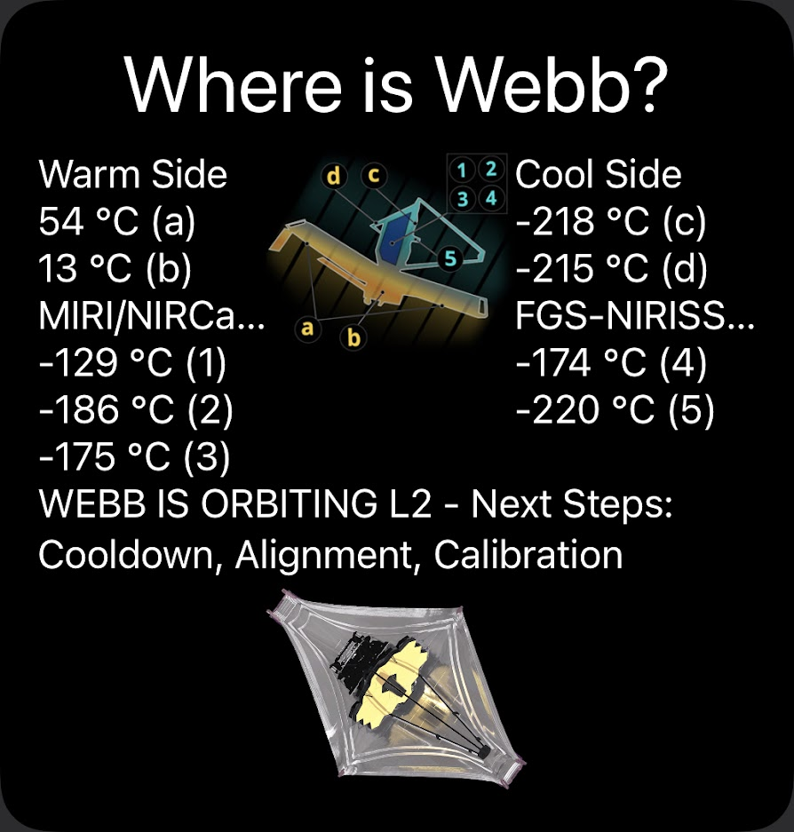

# Where is Webb Scriptable Widget

This Widget shows Information about the current progress of the [James Webb Space Telescope](https://www.jwst.nasa.gov/index.html).
It uses the information provided by the [Where is Webb Web-App](https://www.jwst.nasa.gov/content/webbLaunch/whereIsWebb.html).
Thanks to [@avatsaev](https://github.com/avatsaev) for their [public api](https://github.com/avatsaev/webb-tracker-api) that provides a [REST api](https://api.jwst-hub.com/track).

## Install

## Preview

